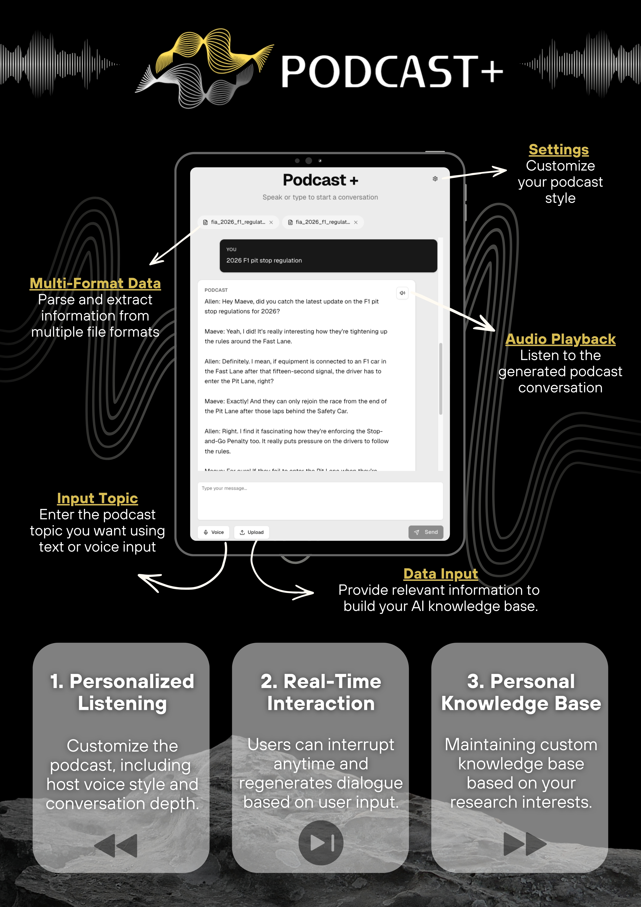

# Podcast+ (Frontend)

<p align="center">
  
</p>

> Turn any knowledge source into a personalized two-host podcast — generated on demand from your own documents, live web results, or a spoken question.

This is the web client for Podcast+. It provides the interface for choosing a style, speaking or typing a topic, uploading documents, and playing the generated episode. All heavy lifting (retrieval, script generation, text-to-speech) is handled by the [Podcast+ backend](https://github.com/Allenwang2004/Podcast-).

---

## What You Can Do

### Personalized Listening
Pick the host voice style (gentle / lively / meditation) and the conversation depth (easy → professional). The same topic can be a casual explainer for a commute or a technical deep-dive for study.

### Real-Time Interaction
Speak or type your topic. Voice input is transcribed with Whisper, and a follow-up question regenerates the next episode around it while keeping the previous episode's context.

### Personal Knowledge Base
Upload PDFs or images (JPG, PNG, GIF, WebP, BMP) from the interface. They are sent to the backend, indexed into your own knowledge base, and every episode is grounded in what *you* provided.

### Live Web Search
Turn on web search to pull fresh sources on the fly. In continued web-search mode, your previous and current queries are merged into one search so follow-ups stay on topic, and past searches are kept in a history panel.

---

## How It Works

The frontend never talks to the backend directly from the browser. Every action goes through a Next.js API route, which forwards the request to the backend (or to OpenAI for speech-to-text and query merging) and returns the result.

```
   browser (podcast-interface.tsx)
              │
              ▼
   ┌───────────────────────────┐
   │   Next.js API routes      │
   │                           │
   │  /api/stt ────────────────┼──▶ OpenAI Whisper (speech → text)
   │  /api/merge-queries ──────┼──▶ OpenAI (combine follow-up queries)
   │  /api/web-search ─────────┼──▶ backend  /api/v1/search-tool/web-search
   │  /api/upload-pdf ─────────┼──▶ backend  /api/v1/rag/upload-pdf
   │  /api/podcast ────────────┼──▶ backend  /api/v1/podcast/generate-dialogue
   │  /api/generate-audio ─────┼──▶ backend  /api/v1/podcast/generate-audio
   └───────────────────────────┘
              │
              ▼
      play the episode in the app
```

1. **Input** — Type a topic or hold the mic button to record; the audio is transcribed via `/api/stt`.
2. **Gather context** — If web search is on, the query is sent to `/api/web-search` (in continued mode it is first merged with the previous query via `/api/merge-queries`). Uploaded files go through `/api/upload-pdf`.
3. **Write the script** — `/api/podcast` sends the instruction, difficulty, web-search context, and previous episode id to the backend, which returns a two-host dialogue.
4. **Voice it** — `/api/generate-audio` sends the dialogue and chosen voice style to the backend, and the finished audio is played back in the interface.

---

## Project Structure

```
app/
  page.tsx                  entry page
  layout.tsx                root layout and metadata
  api/
    stt/                    speech-to-text (OpenAI Whisper)
    merge-queries/          merge follow-up web-search queries (OpenAI)
    web-search/             proxy to backend web search
    upload-pdf/             proxy to backend document upload
    podcast/                proxy to backend dialogue generation
    generate-audio/         proxy to backend text-to-speech
components/
  podcast-interface.tsx     the main UI (input, settings, player, history)
  ui/                       shadcn/ui components
hooks/, lib/, styles/       shared hooks, utilities, and global styles
file/                       README assets
```

---

## Tech Stack

- **Framework** — Next.js 16 (App Router) + React 19 + TypeScript
- **UI** — Tailwind CSS 4, shadcn/ui (Radix UI), lucide-react
- **Speech-to-text** — OpenAI Whisper API
- **Audio capture** — browser `MediaRecorder`
- **Backend** — [Podcast+ backend](https://github.com/Allenwang2004/Podcast-) (FastAPI)
- **Deployment** — Vercel; Docker Compose for local development

---

## Getting Started

Make sure the [backend](https://github.com/Allenwang2004/Podcast-) is running first (default `http://localhost:8001`).

```bash
git clone https://github.com/Allenwang2004/podcast_plus_frontend.git
cd podcast_plus_frontend
cp .env.example .env        # set OPENAI_API_KEY and BACKEND_URL
npm install
npm run dev
```

Open `http://localhost:3000` and generate your first episode.

To run with Docker (hot reload enabled):

```bash
docker compose up --build
```

When running in Docker, set `BACKEND_URL=http://host.docker.internal:8001` in `.env` so the container can reach a backend running on your host machine.

### Environment Variables

| Variable | Description |
|---|---|
| `OPENAI_API_KEY` | Used for speech-to-text and merging follow-up search queries |
| `BACKEND_URL` | URL of the Podcast+ backend (default `http://localhost:8001`) |

---

## Team

**Team PP** — [@Allenwang2004](https://github.com/Allenwang2004), [@0u88](https://github.com/0u88)
